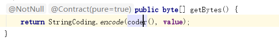
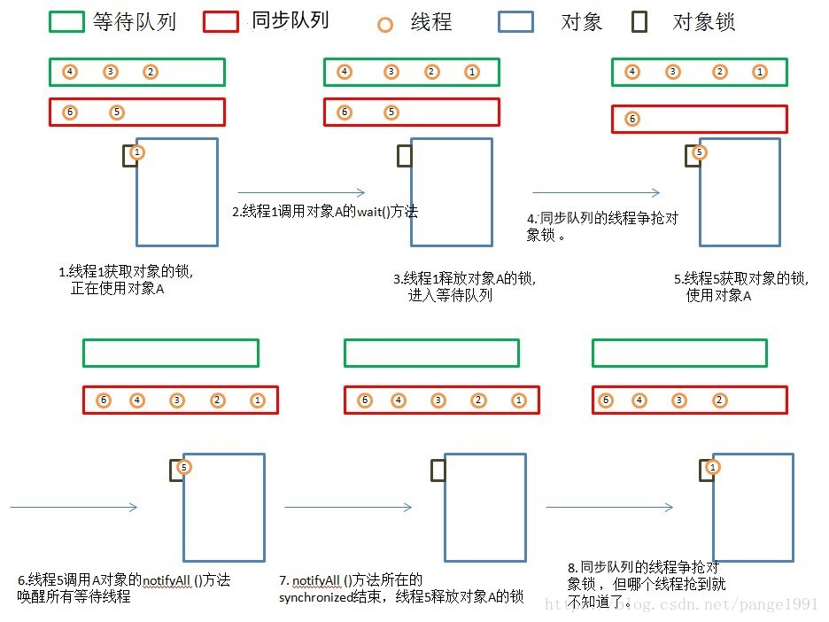

## JAVA代码编译过程


http://www.blogjava.net/xylz/archive/2010/07/08/325587.html

JAVA类的编译过程就是.java文件到.class文件的过程：.java文件 -> 词法分析 -> 语法分析 -> 语义分析 -> 注解处理 -> .class文件

## 类加载机制

1. 根加载器BootStrapClassLoader

加载路径： JVA_HOME/JRE/lib/rt.jar

2. 扩展加载器 ExtensionClassLoader

加载路径: JAVA_HOME/JRE/lib/ext/*.jar

3. 系统应用加载器AppClassLoader

加载路径： 系统classpath

4. 用户自定义加载器CustomerClassLoader

加载路径: 自定义路径

在程序执行前要检查类是否被加载， 检查的过程是检查CustomerClassLoaer加载的类 -> AppClassLoader加载的类 -> ExtensionClassLoaer加载的类 -> BootStrapClassLoader加载的类， 如果发现类未被加载， 进行加载， 加载的方式， 按以下顺序在加载路径中寻找该类： BootStrapClassLoader -> ExtensionClassLoader -> AppClassLoader -> CustomerClassLoader

## 类执行机制

1. 连接， 分三个步骤：

* 验证verifying：验证类符合Java规范和JVM规范，和编译阶段的语法语义分析不同

* 准备preparing：为类的静态变量分配内存，初始化为系统的初始值。（不初始化静态代码块）。对于final static修饰的变量，直接赋值为用户的定义值

* 解析resolving：将符号引用（字面量描述）转为直接引用（对象和实例的地址指针、实例变量和方法的偏移量）

2. 类的初始化


注意： 使用static final 修饰的常量不会出发类的初始化

## JAVA中的内存分配

## JAVA字节码文件（.class）

## JAVA中的不可变对象

不可变对象指对象创建后它的状态（对象的数据，也就是兑现那个中的属性值）就不能改变， java库中的不可变对象有String, 各种包装类（Inetger, Long, Float）, BigInteger, BigDecimal;

### 不可变对象的实现方法

1. 确保类不能被继承 - 将类声明为final, 或者使用静态工厂并声明构造器为private；

2. 声明属性为private 和 final；

3. 如果类有任何可变对象属性, 那么当它们在类和类的调用者间传递的时候必须被保护性拷贝，如为什么说String是不可变的， 如下图：



String 通过byte[] value存储字节， 但是getBytes方法并不返回value本身， 而是重新生成一个byte[];

### 不可变对象的好处

1. 线程安全

2. clone简单

### 为什么Final修饰的变量、方法是线程安全的


## JAVA反射

### Constructor类及其方法

### Field类及其方法

### Method类及其方法

### JAVA 深clone 和浅clone

1. 浅clone会复制引用但不会复制引用对象；
2. 深clone会复制引用并且会复制引用对象；

实现浅拷贝, 其中name 不会重新开辟内存空间， address也不会重新开辟内存空间， 但是拷贝的person会重新开辟内存空间， 只是将name和address指向了原来的内存地址；

```
public class Person implements Cloneable{

    private int age;
    private String name;
    private Address address;

    public int getAge() {
        return age;
    }

    public void setAge(int age) {
        this.age = age;
    }

    public String getName() {
        return name;
    }

    public void setName(String name) {
        this.name = name;
    }

    public Address getAdderss() {
        return address;
    }

    public void setAdderss(Address address) {
        this.address = address;
    }

    @Override
    protected Object clone() throws CloneNotSupportedException {
        return super.clone();
    }

    public class Address implements Cloneable {

    private String country;

    private String sheng;

    public String getCountry() {
        return country;
    }

    public void setCountry(String country) {
        this.country = country;
    }

    public String getSheng() {
        return sheng;
    }

    public void setSheng(String sheng) {
        this.sheng = sheng;
    }

    @Override
    protected Object clone() throws CloneNotSupportedException {
        return super.clone();
    }
}
}
```

实现深拷贝, name不会开辟新的内存空间， 但是address会开辟新的内存空间， 因为Address也实现了Cloneable

```
public class Person implements Cloneable{

    private int age;
    private String name;
    private Address address;

    public int getAge() {
        return age;
    }

    public void setAge(int age) {
        this.age = age;
    }

    public String getName() {
        return name;
    }

    public void setName(String name) {
        this.name = name;
    }

    public Address getAdderss() {
        return address;
    }

    public void setAdderss(Address address) {
        this.address = address;
    }

    @Override
    protected Object clone() throws CloneNotSupportedException {
        // 注意这里一定要用super, 不能使用this
        Person copy = (Person) super.clone();
        copy.address = (Address) this.address.clone();
        return copy;
    }
}

public class Address implements Cloneable {

    private String country;

    private String sheng;

    public String getCountry() {
        return country;
    }

    public void setCountry(String country) {
        this.country = country;
    }

    public String getSheng() {
        return sheng;
    }

    public void setSheng(String sheng) {
        this.sheng = sheng;
    }

    @Override
    protected Object clone() throws CloneNotSupportedException {
        return super.clone();
    }
}
```

### JAVA中的引用类型

https://www.cnblogs.com/liyutian/p/9690974.html

## JAVA如何创建一个对象

1. new

2. 反射

3. clone

4. 序列化

## JAVA序列化


## JAVA HashMap的实现原理

hashMap使用数组链表实现的， 如下图


构造方法如下图


Put操作如下：


首先调用每个key的hashCode方法， 然后计算每个Key的散列位置， 在相应位置形成第一个节点（hashMap在相同散列位置的链表节点插入使用头节点插入的方法）


## Object中的公共方法

1. equals()

2. clone()

3. getClass()

4. notify() && notifyAll() && wait()

## 封装类使用的好处

## JAVA中的hashCode()

如果不重写hashCode()， 返回JVM中的32位内存地址

## JAVA Class

首先RTTI(Run-Time Type Identification)运行时类型识别， 其作用是在运行时识别一个对象的类型和类的信息，这里分两种：传统的”RRTI”,它假定我们在编译期已知道了所有类型(在没有反射机制创建和使用类对象时，一般都是编译期已确定其类型，如new对象时该类必须已定义好)，另外一种是反射机制，它允许我们在运行时发现和使用类型的信息。在Java中用来表示运行时类型信息的对应类就是Class类。

对于同一个对象， 无论创建多少实例， 在内存中只有一个Class对象。

获得Class对象的方法：

* Object.class

* obj(一个实例).getclass()

* Class.forName("")

## JAVA泛型


# JAVA 并发

## JAVA 线程的状态

JAVA 中的线程一共有6种状态

1. 初始（NEW）, 创建一个新的线程， 但还没有调用start()方法；
2. 运行（RUNNABLE）, JAVA种线程就绪（READY在这种状态下线程运行的前提条件都已准备好， 就等CPU进行调度）和运行中（RUNNING, 获取到了CPU的执行权， 开始执行）统称为“运行”;
3. 阻塞（BLOCKED）, 表示线程阻塞于锁(获取锁而阻塞)；
4. 等待（WAITING）， 表示该线程需要其他线程做出一些特定的的动作（通知或中断）
5. 超时等待（TIMED_WAITING）, 与WAITING不同的是， 在一定时间后自行返回
6. 终止（TERMINATED）, 线程终止

### 状态转换图


### 等待队列与同步队列

处于同步队列种的线程是具备抢夺锁能力的线程， 处于等待队列的线程是使用了wait()方法的线程



### 几个线程方法比较

1. Thread.sleep(long millis)，一定是当前线程调用此方法，当前线程进入TIMED_WAITING状态，但不释放对象锁，millis后线程自动苏醒进入就绪状态；
2. Thread.yield()，一定是当前线程调用此方法，当前线程放弃获取的CPU时间片，但不释放锁资源，由运行状态变为就绪状态，让OS再次选择线程。作用：让相同优先级的线程轮流执行，但并不保证一定会轮流执行。实际中无法保证yield()达到让步目的，因为让步的线程还有可能被线程调度程序再次选中。Thread.yield()不会导致阻塞。该方法与sleep()类似，只是不能由用户指定暂停多长时间。
3. t.join()/t.join(long millis)，当前线程里调用其它线程t的join方法，当前线程进入WAITING/TIMED_WAITING状态，当前线程不会释放已经持有的对象锁。线程t执行完毕或者millis时间到，当前线程进入就绪状态。
4. obj.wait()，当前线程调用对象的wait()方法，当前线程释放对象锁，进入等待队列。依靠notify()/notifyAll()唤醒或者wait(long timeout) timeout时间到自动唤醒。
5. obj.notify()唤醒在此对象监视器上等待的单个线程，选择是任意性的。notifyAll()唤醒在此对象监视器上等待的所有线程。

## JAVA中的synchronized

简单的说synchronized(xxx), xxx可以是普通实例， Class对象， this, static修饰的静态成员变量；
其中普通实例, this表示锁实例， 不锁Class； 
Class对象， static修饰的静态成员变量表示锁Class对象；
synchroniezed还可以放在方法声明前， 如果修饰的静态方法， 表示锁Class对象， 如果是放在非static修饰的方法声明前表示锁实例；
一个线程放弃锁的情况有三种：
* 执行完锁中的代码
* 发生异常
* 当前线程被阻塞， 如wait()
注意：实例锁， 类锁是两种不通的锁

```(java)
public class A {

    public synchronized void method1() {
        System.out.println(Thread.currentThread().getName() + "is excute method1.");
        try {
            TimeUnit.SECONDS.sleep(20);
        } catch (InterruptedException e) {
            e.printStackTrace();
        }
    }

    public synchronized void method2() {
        System.out.println(Thread.currentThread().getName() + "is excute method2.");
        try {
            TimeUnit.SECONDS.sleep(20);
        } catch (InterruptedException e) {
            e.printStackTrace();
        }
    }
}

public class Test {
    public static void main(String[] args) throws ClassNotFoundException, IllegalAccessException, InstantiationException {

        A a = new A();
        // A b = new A();
        new Thread(() -> {
            a.method1();
        }).start();

        new Thread(() -> {
            // 会阻塞， 实例锁是锁这个实例
            a.method2();
        }).start();
    }
}

```

## JAVA中的LOCK


https://www.cnblogs.com/aishangJava/p/6555291.html

## JAVA NIO

java NIO由以下几个核心部分构成：

* Channels

* Buffers

* Selectors

Channel的实现有

* FileChannel

* DatagramChannel

* SocketChannel

* ServerSocketChannel

Buffer的实现有：


* ByteBuffer

* CharBuffer

* DoubleBuffer

* FloatBuffer

* IntBuffer

* ShortBuffer

使用buffer一般有以下几个步骤：

1. 写数据到buffer

2. 调用flip()方法

3. 从buffer中读取数据

4. 调用clear()方法或者Compact()方法

buffer三个属性：capacity(容量), position（当前读写的位置）, limit（写模式下Limit就是capacity, 读模式下可以指定）

分配buffer的大小：

ByteBuffer buf = ByteBuffer.allocate(48)

向buf中写入数据：

* 从Channel写到buffer中

```
int bytesRead = inChannel.read(buf)
```

* 通过put方法写入数据

```
buf.put(xxx)
```

从buffer中读取数据

* 从buffer读取数据到Channel

```
int byteWriten = inChannel.write(buf)
```

* 使用get()方法从buffer中读取数据

```
byte b = buf.get()
```

flip()方法：

将buffer从写模式切换到读模式， 并且将position置零， 将limit设置为原来position的数值

rewind()方法：

将position重新置零

clear()方法：

将position置零， limit设置为capacity也就是说会忽略掉buffer中原有的数据；

compact()方法：

compact()方法将所有未读的数据拷贝到Buffer起始处。然后将position设到最后一个未读元素正后面。limit属性依然像clear()方法一样，设置成capacity。现在Buffer准备好写数据了，但是不会覆盖未读的数据

mark()与reset()方法：

mark()会标记一个position, 使用reset()会返回到标记的这个position


Select允许在一个线程中处理多个Channel

### Scatter/ Gather

scatter/gather用于描述从Channel中读取或者写入数据

scatter(分散)指将Channel中的数据分散到几个Buffer中；

gather(聚集)指将buffer中的数据聚集到一个Channel中；

```
ByteBuffer header = ByteBuffer.allocate(128);
ByteBuffer body   = ByteBuffer.allocate(1024);
ByteBuffer[] bufferArray = { header, body };
channel.read(bufferArray);
```

```
ByteBuffer header = ByteBuffer.allocate(128);
ByteBuffer body   = ByteBuffer.allocate(1024);
ByteBuffer[] bufferArray = { header, body };
channel.write(bufferArray);
```

### Channel间的通信

transferFrom()方法：

```
RandomAccessFile fromFile = new RandomAccessFile("fromFile.txt", "rw");
FileChannel      fromChannel = fromFile.getChannel();
RandomAccessFile toFile = new RandomAccessFile("toFile.txt", "rw");
FileChannel      toChannel = toFile.getChannel();
//从什么位置开始传
long position = 0;
//传多少字节， 如果toChannel剩余空间小于count， 则传送的
//字节数会少于count
long count = fromChannel.size();
toChannel.transferFrom(position, count, fromChannel);

```

### Select

Select的创建：

```
Selector selector = Selector.open()
```

Select绑定Channel:

使用Selector时通道必须处于非阻塞模式， 所以FileChannel无法使用Selector;

register的第二个参数是一个“interests”集合， 表示这个通道对什么事件感兴趣：

* Connection 某个channel成功连接到另一个服务器称为“连接就绪”

* Accept 一个server socket channel准备好接收新进入的连接称为“接收就绪”

* Read 一个有数据可读的通道可以说是“读就绪”

* write 等待写数据的通道可以说是“写就绪”

```
channel.configureBlocking(false);
SelectionKey key = channel.register(selector,
    Selectionkey.OP_READ)
```

如果你对不止一种事件感兴趣，那么可以用“位或”操作符将常量连接起来，如下：

```
int interestSet = SelectionKey.OP_READ | SelectionKey.OP_WRITE;
```

SelectionKey中包含的内容：

* interest集合

* ready集合

* Channel

* Selector

完整示例代码：

```
Selector selector = Selector.open();
channel.configureBlocking(false);
SelectionKey key = channel.register(selector, SelectionKey.OP_READ);
while(true) {
    //如果没有channel准备就绪， select()会阻塞
  int readyChannels = selector.select();
  if(readyChannels == 0) continue;
  Set selectedKeys = selector.selectedKeys();
  Iterator keyIterator = selectedKeys.iterator();
  while(keyIterator.hasNext()) {
    SelectionKey key = keyIterator.next();
    if(key.isAcceptable()) {
        // a connection was accepted by a ServerSocketChannel.
    } else if (key.isConnectable()) {
        // a connection was established with a remote server.
    } else if (key.isReadable()) {
        // a channel is ready for reading
    } else if (key.isWritable()) {
        // a channel is ready for writing
    }
    keyIterator.remove();
  }
}
```

通过SelectorKey返回Channel:

```
Selectorkey.channel()
```